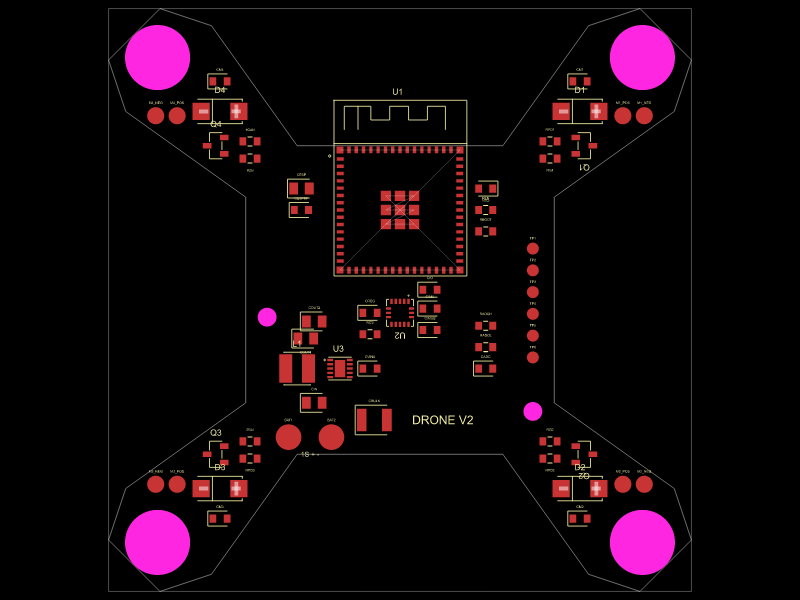

# Drone V2

A compact, two-layer PCB microdrone with an interactive assembly viewer.

- `pcb/` — tscircuit source, JLCPCB imports, mechanical dimensions, netlist tests and placement drawings.
- `cad/` — Three.js assembly viewer, generated PCB data and Vercel configuration (separate CAD PR).
- [ISSUES.md](ISSUES.md) — tooling blockers, mechanical assumptions and work required before routing/manufacture.

The two-layer specification supersedes the earlier four-layer proposal. Routing is deliberately disabled. No fabrication or flight release is implied.

See [PCB instructions](pcb/README.md) for setup, validation, sourcing and pin mapping.
