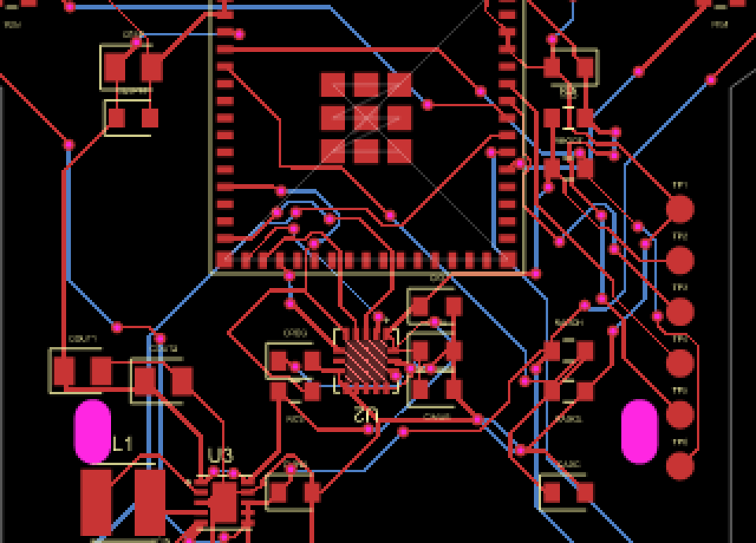
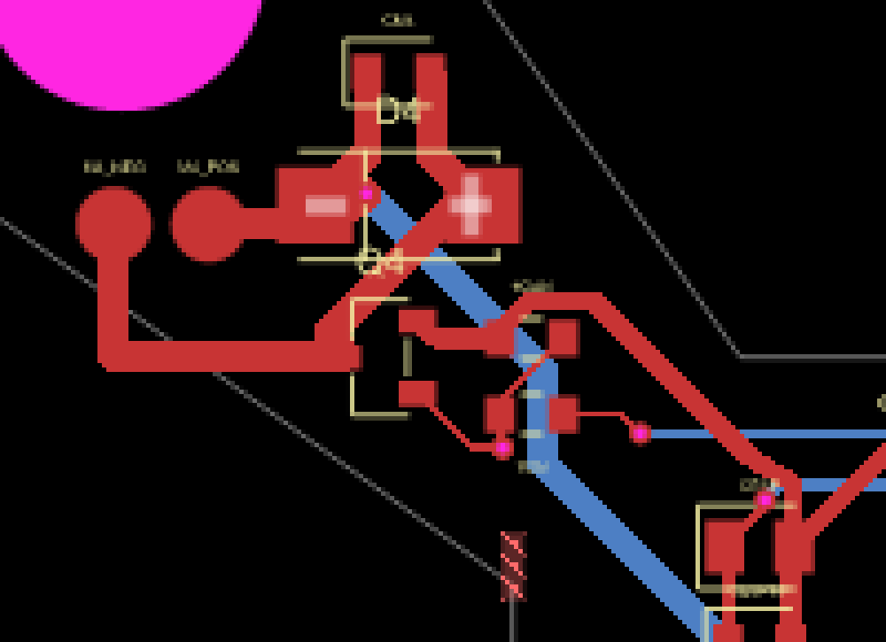
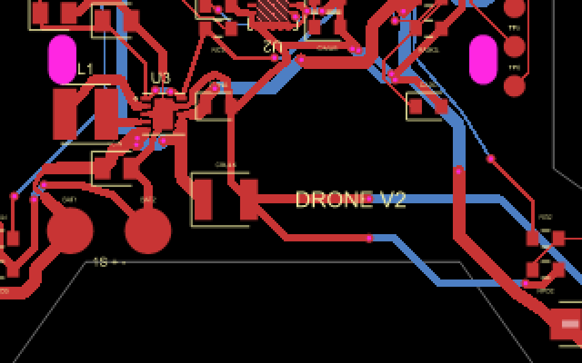
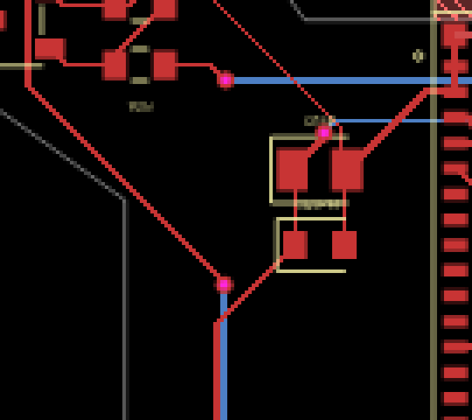

# tscircuit routing issues

Routing work in progress on `pcb/routing`. Toolchain: tscircuit 0.0.2527 / CLI 0.1.2063. This document records observed tool behavior and reproductions, separately from hardware qualification in ISSUES.md.

## Result of the first routing session

- 131 trace paths, 73 vias, one bottom GND pour, and three copper keepouts.
- Netlist, schematic placement and PCB placement pass. The TypeScript check passes.
- The pill-hole patch test, electrical net assertions and zip-tie clearance test pass. The no-error-records test intentionally fails.
- **99 trace-to-board-edge errors remain.** Both pipeline 9 and pipeline 7 reproduce the wider-power routing failure. Neither output is suitable for fabrication. The draft preserves the errors rather than suppressing checks.
- Power distribution needs constrained/manual routing or a router fix that respects the actual X outline during power expansion. Motor current, trace necks, via current and ground-return topology still require hardware review.

The existing CAD deployment and published placement package remain unchanged by this routing draft.

### Cropped snapshots

These are crops of actual generated routing snapshots, enlarged without smoothing. Red is top copper, blue is bottom copper, magenta marks non-plated openings, and the thin gray line is the PCB outline.



The two magenta rounded slots trigger TS-002 in the unpatched checker. The hatched area inside the IMU pad ring is the real copper exclusion.



The wide red path below the upper-left motor terminals crosses outside the gray arm outline. This is an invalid route, not extra PCB material.



The blue power-return path below the central body also leaves the board. These are examples of TS-005; passing router status did not mean passing final DRC.



The original narrower route also had a small edge-clearance violation near the left arm root; see the exact coordinate and measured gap in TS-005.

## TS-001 — documented pcbkeepout tag is unsupported

**Status:** resolved in this branch; both layers are confirmed in emitted router obstacles.

The project-local element guide advertises `<pcbkeepout />`, but core registers `<keepout />`. The installed JSX types and Keepout implementation support the latter and emit `pcb_keepout` records. This corrects the earlier conclusion that keepout support itself was absent.

Reproduction: add `<pcbkeepout shape="rect" width={2} height={2} />` to a board and run `bunx tsci check netlist`. The prior run reported `Unsupported component type "pcbkeepout"`.

Action: use the supported `<keepout />` for the inner IMU copper exclusion; verify both layers are present in routing obstacles. The broad antenna assembly clearance volume is not a blanket copper exclusion across the motor arms.

## TS-002 — pill-shaped non-plated holes crash routed DRC

**Status:** reproduced with @tscircuit/checks 0.0.189 (current registry version). A conservative local dependency patch is committed and regression-tested.

The first route generated 131 trace records in 10.2 seconds, then the build exited 1 with:
```
Could not determine radius of element: {"type":"pcb_hole", ...,
"hole_shape":"pill","hole_width":1.8,"hole_height":3.2,"x":-13.5,"y":-5}
```
`checkEachPcbTraceNonOverlapping` classifies every `pcb_hole` as circular; its radius helper supports only circular holes. Proposed workaround: only enter the circle branch for circle holes. Pill holes then use the existing bounding-box clearance calculation, conservatively blocking the rounded corners too. This preserves slot geometry and does not disable DRC.

Evidence: [first build log](pcb/issues/first-routing-build.txt), [router input](pcb/issues/first-route-input.json), [raw route paths](pcb/issues/first-route-traces.json).

## TS-003 — net/component name collisions only surface during routing

**Status:** names corrected; the timing of the diagnostic remains an upstream issue.

Placement and netlist checks pass, but routing reports “Multiple immediate children found with name” for `L1` and `M1_NEG` through `M4_NEG`. These are both component reference names and implicit net names. Rename the inductor nets to `SW_L1/SW_L2` and motor switched nets to `M1_SWITCHED` etc.; preserve component names and connectivity. Earlier checks should expose this conflict before autorouting.

## TS-004 — net nominalTraceWidth is accepted but not passed to the router

**Status:** reproduced; explicit trace constraints successfully set the emitted router widths.

The design specifies 0.8 mm VBAT/motor, 0.6 mm switch-node, 0.5 mm GND and 0.3 mm 3V3 nominal widths. However, all 28 connections in the emitted SimpleRouteJson have `nominalTraceWidth: 0.2` (the board default). Core's Net source renderer omits this prop, and the route converter only reads widths from source traces. Do not interpret an error-free autoroute as qualified motor-current copper.

## TS-005 — autorouter output violates its own board-edge constraint

**Status:** open. A local obstacle did not resolve the broader power-route failures.

After the pill-check patch and naming fixes, DRC completes and reports one trace at (-17.9938, 12.5318) whose centerline is 0.380 mm from the edge, less than the required 0.387 mm including half-width and the 0.3 mm margin. The router itself reported zero errors. This is a small but real mismatch; final DRC remains enabled.

Evidence: [routed circuit with error](pcb/issues/route-with-edge-error.json). A local copper keepout was added at the initial failure; subsequent wider-power routing still violates the outline elsewhere.

### TS-002 follow-up — pill bounds collapse to a point

A regression test caught a second failure: `getBoundsOfPcbElements` returns `{minX:0,minY:0,maxX:0,maxY:0}` for a 1.8 × 3.2 mm pill at (0,0). Merely avoiding the circular branch misses a trace 0.1 mm from the slot edge. The local checks patch therefore also computes explicit pill bounding boxes. The test checks contact, insufficient clearance, and a clear trace; the patch deliberately overestimates pill corners.

### TS-004/005 — wider power expansion produces off-board routes

Explicit trace thicknesses do reach the router (0.8 mm VBAT and motor switched nets, 0.6 mm switch nodes, 0.5 mm GND). However pipeline 9 reports zero routing errors while final DRC finds **99 board-edge trace errors**, including traces crossing outside the X-shaped outline. Evidence: [wide route input](pcb/issues/wide-route-input.json), [circuit with DRC errors](pcb/issues/wide-route-errors.json). Width settings therefore need final geometry validation, not just inspection of router inputs.

## TS-006 — copper pour margin differs from final DRC by rounding

A bottom GND pour requested with `boardEdgeMargin={0.3}` is reported at 0.299 mm by the copper-to-edge checker against the 0.300 mm rule. Resolved with a 0.4 mm pour margin while preserving the board's 0.3 mm rule.
