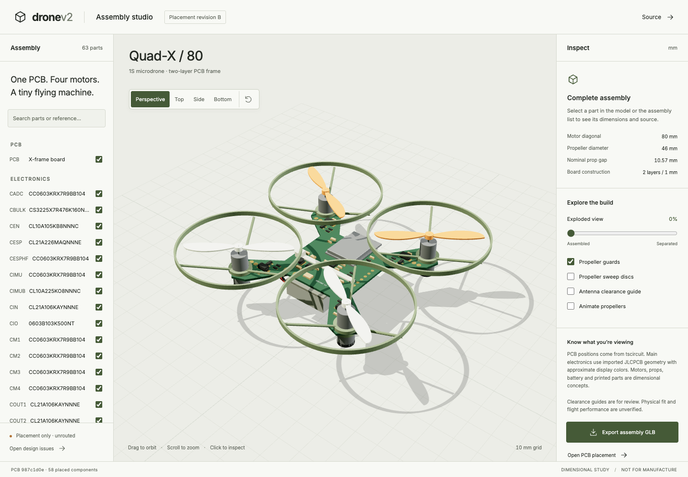

# Assembly studio

[Live viewer](https://dronev2-cad.vercel.app)

Interactive Three.js CAD-style viewer for the Drone V2 PCB. Orbit, inspect components, choose camera views, toggle parts, explode the assembly and export visible geometry as GLB. It does not edit PCB placement or control a flying drone.

```sh
cd cad
bun install --frozen-lockfile
bun run dev
bun run build
bunx playwright test
```

For tests, install Playwright Chromium with `bunx playwright install chromium` when a local Chrome installation is unavailable. Tests start the dev server automatically. `TEST_URL` can target an existing deployment.

## Updating the PCB

Build and validate `../pcb` first, then run `bun run sync-pcb`. The script refuses circuit JSON containing error records. It copies the source outline, holes, pads, component placements, drawing exports and vendor models into `public/pcb/`; `provenance.json` identifies the circuit JSON by SHA-256. Committed generated assets keep Vercel builds independent of the PCB toolchain.

## Model fidelity

PCB outline/holes/pads and electronic placements are compiled tscircuit data. Main components use JLCPCB-imported OBJ geometry, with approximate display materials because the importer did not provide material libraries. Passive parts use generic package envelopes. The four motors, propellers, battery, collars, guards, canopy, insulating pad and zip tie are provisional dimensional concepts. The canopy starts hidden so electronics can be inspected.

The page labels these limits. Export preserves visible parts and explosion state, converts millimetres to glTF metres and excludes the scene floor/grid and selection outline. Printed parts are not print-ready mechanical designs. No flight, mass or clearance validation is claimed.

## Deploy

Vercel project: `dronev2-cad`, GitHub root directory `cad`. Production is deployed from the repository root using its linked project, or through the Vercel GitHub integration after merge. No runtime environment variables are required. `.vercel/` and `.env*` are ignored.

## Verified result

Production smoke tests passed on the live URL: desktop model loading, component inspection, views, exploded state, selection/visibility consistency, GLB download, mobile layout and parts drawer. The rendered PCB provenance hash matches the compiled source.



Revision B replaces the printed battery saddle with a 1 mm insulating pad and a 2.5 mm zip tie through two actual rounded PCB slots. The top run has a checked component-free lane. Motor collars are labeled as unselected mount placeholders; rubber supplier dimensions remain unresolved in ISSUES.md.
